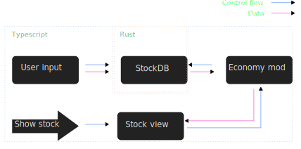
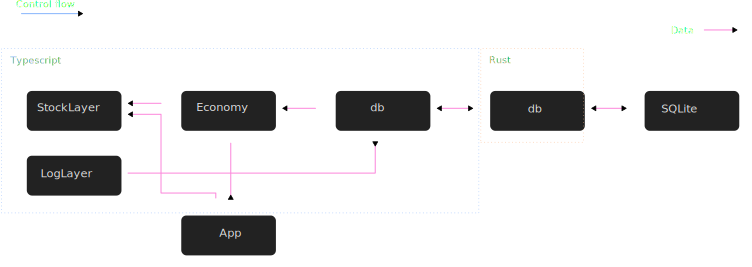

# Architecture
Store your own local long-term market data.

## Table of Contents

- [Overview](#overview)
- [Tech Stack](#tech-stack)
- [Project Structure](#project-structure)
- [Data Flow](#data-flow)
- [Key Components](#key-components)
- [Data Model](#data-model)
- [External Dependencies](#external-dependencies)
- [Known Limitations](#known-limitations)

---

## Overview
StockDB is ment to be a simple way to store local data about stocks inorder to be able to identify and evaluate stocks based on long-term market data. 

To accomplish this a SQLite database is accessed using rusqlite and a tauri backend. The tauri is mostly a wrapper for the database. 

<!-- 2–4 sentences. What problem does this solve, and what is the high-level approach?
     Think: if someone asked "how does this work?" at a party, what would you say? -->

## Tech Stack

| Layer       | Technology      | Why                                  |
|-------------|-----------------|--------------------------------------|
| Language    | Rust, Typescript| Tauri, types                         |
| Framework   | Vanilla JS      | Custom look, familiarity, simplicity |
| Database    | SQLite          | Simplicity                           |

## Project Structure

```
project-root/
├── docs/          # Documentation
├── dist/          # Dist folder created during build
├── public/        # Files accessed during run-time
├── src/           # Front end source code
└── src-tauri/     # Back end source code
```


## Data Flow
The data that is entered by the user is passed directly to the database to make sure it stays up to date. 




The program interacts with the SQL database through a Typescript wrapper of a custom Rust API based on rusqlite. 
```
SQL Database   ------->       Rust db-module      ------------->      Typescript
               Rusqlite                           Custom wrapper
```  

<!-- Describe how data moves through the system, from input to output.
     A numbered list or simple ASCII diagram works well here. Example:

1. User submits a request via the CLI
2. Request is validated and parsed
3. Core logic runs and produces a result
4. Result is written to the database / returned to the user
-->

## Key Components
In this section you will find information about what each component does. The components relates to each other as follows.



### db
The db module is a wrapper for the Rust module that manages the SQLite database. The wrapper uses the following custom structs.

+ **QuarterlyReport:** Contains the data for a QuarterlyReport in the database. The QuarterlyReport contains the data that is reported at either yearly or (as the name implies) quarterly. If the fiscal_quarter has a value of 0, the report is for the whole year. The implementation can be found in [quarterly.ts](../src/db/quarterly.ts). 

+ **StockListItem:** A small struct that contains the id, ticker and name for a stock and is mostly used as an efficient way of storing the id for a stock. The implementation can be found in [stocks.ts](../src/db/stocks.ts)

+ **StockInfo:** A struct for storing the data about a stock that remains the same, such as id, exchange and sector. The implementation can be found in [stocks.ts](../src/db/stocks.ts)


The main API is built in the [db.ts](../src/db/db.ts) file. The structs are then imported from separate files.


### Economy
<!-- What is it, what does it do, and why does it exist as a separate piece? -->
The economy module purpose is to manage the data for stocks and is based on the db module. The economy module currently consists of the following

+ **Stock class:** Manages and owns the data for a single stock. The stock class contains a StockListItem and StockInfo along with Quarterly reports. The class is implemented in the [stock.ts](../src/economy/stock.ts). 

#### Future
+ Consider changing the economy module to have ownership for all the stocks.


### 
<!-- Repeat for each meaningful component, module, or service. -->

## Data Model

<!-- Describe your main data structures, database schema, or key types.
     Can be prose, a table, or a code block. Example:

```
User
  id         UUID
  email      string
  created_at timestamp

Post
  id         UUID
  user_id    UUID (FK → User)
  content    string
```
-->


## Known Limitations
+ The DB currently only works with Quarly reports
+ The data in the DB can not currently be modifyed
+ The data is not stored in the standardized format
<!-- Honest notes about shortcuts taken, things that don't scale, or areas to improve.
     This is especially useful for future-you. Examples:
     - "Auth is hardcoded for single-user use only"
     - "No pagination on list endpoints yet"
     - "Assumes UTC timestamps everywhere"
-->